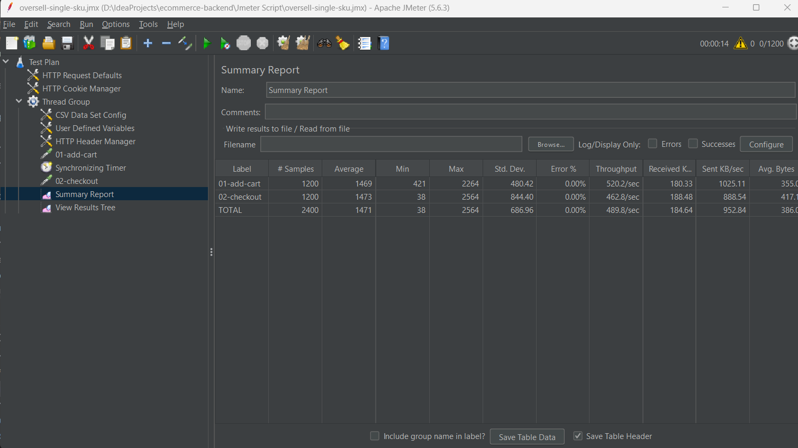
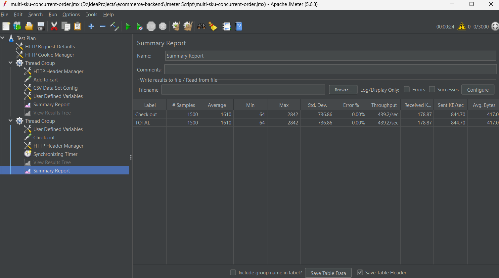

# JMeter Testing Guide

Tài liệu này hướng dẫn chạy và đọc kết quả kiểm thử tải cho backend consumer dùng LSF. README chính chỉ giữ phần tóm tắt; các bước chi tiết, token, ảnh benchmark và cách diễn giải kết quả được đặt tại đây để README gọn hơn nhưng vẫn đủ bằng chứng cho bảo vệ luận văn.

## Kịch bản kiểm thử

| File | Mục tiêu | Dữ liệu CSV |
|---|---|---|
| [`../Jmeter Script/oversell-single-sku.jmx`](../Jmeter%20Script/oversell-single-sku.jmx) | Nhiều request cùng đặt mua một SKU để kiểm tra khả năng chặn oversell | [`../Jmeter Script/data_oversell.csv`](../Jmeter%20Script/data_oversell.csv) |
| [`../Jmeter Script/multi-sku-concurrent-order.jmx`](../Jmeter%20Script/multi-sku-concurrent-order.jmx) | Nhiều request checkout trên nhiều SKU để kiểm tra tải phân tán | [`../Jmeter Script/data_multi.csv`](../Jmeter%20Script/data_multi.csv) |

## Chuẩn bị trước khi chạy

Trước khi mở JMeter, cần kiểm tra:

- `discovery-server`, `api-gateway`, `user-service`, `product-service`, `cart-service`, `inventory-service`, `order-service`, `payment-service` và `notification-service` đang chạy.
- Kafka, MySQL, Redis, Keycloak, Prometheus và Grafana đã sẵn sàng từ `docker compose up -d`.
- SKU trong file CSV tồn tại thật và còn dữ liệu tồn kho phù hợp với mục tiêu test.
- Token JWT còn hiệu lực và được cấu hình trong `HTTP Header Manager`.
- Host/port trong các `HTTP Request` trỏ đúng môi trường đang chạy, ví dụ `localhost:8000` hoặc IP WSL2 nếu chạy backend trong WSL.

## Lấy access token bằng API

Các request checkout trong JMeter cần header:

```text
Authorization: Bearer <access_token>
```

Tài khoản demo của ứng dụng:

| Username | Password | Ghi chú |
|---|---|---|
| `admin` | `admin123456@` | Tài khoản admin được seed bởi `user-service`; chỉ dùng cho demo/local |

Lấy token bằng `curl`:

```bash
curl -X POST http://localhost:8000/auth/login \
  -H "Content-Type: application/json" \
  -d '{
    "username": "admin",
    "password": "admin123456@"
  }'
```

Hoặc dùng PowerShell:

```powershell
$body = @{
  username = "admin"
  password = "admin123456@"
} | ConvertTo-Json

$response = Invoke-RestMethod `
  -Method Post `
  -Uri "http://localhost:8000/auth/login" `
  -ContentType "application/json" `
  -Body $body

$response.access_token
```

Response trả về từ Keycloak có dạng JSON và chứa `access_token`, `refresh_token`, `expires_in`. Copy giá trị `access_token` rồi cấu hình vào JMeter.

## Cấu hình token trong JMeter

Các file `.jmx` có thể còn lưu token cũ từ lần demo trước, vì vậy cách chắc chắn nhất là mở từng `HTTP Header Manager` và thay giá trị:

```text
Authorization: Bearer <access_token_mới>
```

Nếu muốn chạy bằng command line, có thể cấu hình header trong JMeter thành một trong hai dạng sau:

```text
Authorization: Bearer ${ACCESS_TOKEN}
```

hoặc:

```text
Authorization: Bearer ${__P(access_token,REPLACE_ME)}
```

Khi header đã dùng property `access_token`, có thể truyền token lúc chạy:

```bash
jmeter -t "Jmeter Script/multi-sku-concurrent-order.jmx" -Jaccess_token="<access_token_mới>"
```

Nếu chạy bằng giao diện JMeter, chỉ cần sửa trực tiếp token trong `HTTP Header Manager` hoặc trong `User Defined Variables` nếu header đang trỏ tới biến `ACCESS_TOKEN`.

## Cấu hình host, CSV và số thread

Trong mỗi file `.jmx`, kiểm tra lại:

- `HTTP Request Defaults`: `Server Name or IP` và `Port Number`.
- `CSV Data Set Config`: đường dẫn tới `data_oversell.csv` hoặc `data_multi.csv`.
- `Thread Group`: số user/thread, ramp-up và loop count.
- `Synchronizing Timer`: số request được đồng bộ cùng lúc, cần khớp với mức tải muốn đo.
- `RUN_PREFIX`: nên đổi mỗi lần benchmark để tránh trùng dữ liệu order/cart giữa các lần chạy.

Nếu file `.jmx` đang giữ đường dẫn tuyệt đối cũ cho CSV, hãy sửa lại thành đường dẫn hiện tại trên máy của bạn hoặc dùng đường dẫn tương đối trong thư mục `Jmeter Script/`.

## Cách đọc kết quả oversell trên một SKU


Kịch bản oversell tạo nhiều request add-cart và checkout cùng tranh một SKU. Mục tiêu không phải mọi checkout đều thành công, mà là hệ thống phải từ chối phần vượt quota thay vì để tồn kho bị bán âm.


Summary Report cho thấy số lượng request, latency trung bình, throughput và error rate trong lúc tải cao. Error ở checkout cần đọc cùng dashboard quota: một phần request bị từ chối là hành vi kỳ vọng khi hệ thống chặn oversell hoặc dữ liệu không còn đủ điều kiện checkout.



Ảnh này là một mốc chạy khác của cùng kịch bản oversell, với 1.200 request add-cart và 1.200 request checkout. Kết quả này giúp so sánh nhiều mức tải khác nhau trước khi kết luận hệ thống ổn định ở ngưỡng nào.


Dashboard quota là bằng chứng quan trọng nhất của kịch bản oversell:

- `Quota Reserve Accepted`: số lượt giữ tài nguyên thành công.
- `Quota Reserve Rejected`: số lượt bị từ chối do vượt khả năng cấp phát.
- `Quota Confirm OK`: số reservation được xác nhận sau khi flow thành công.
- `Quota Release OK`: số reservation được trả lại khi flow thất bại hoặc bị hủy.


Dashboard outbox cho thấy cơ chế publish event bất đồng bộ đang hoạt động dưới tải:

- `Outbox Append`: số event được ghi vào bảng outbox.
- `Outbox Sent`: số event publisher đã gửi thành công.
- `Outbox Retry` và `Outbox Fail`: dùng để phát hiện lỗi publish.
- `Outbox Pending`: event còn chờ xử lý tại thời điểm chụp, thường xuất hiện khi tải cao vì publisher chạy nền theo batch/poll.


Ảnh tồn kho sau test cho thấy hệ thống tách rõ `Tồn vật lý`, `Khả dụng` và lượng đang `Giữ`. Đây là bằng chứng trực quan cho mô hình `reserve -> confirm / release`: tồn khả dụng không còn được hiểu đơn giản là số lượng còn trong database.

## Cách đọc kết quả tải đồng thời trên nhiều SKU


Kịch bản multi-SKU phân tán request checkout trên nhiều biến thể sản phẩm. Kịch bản này dùng để quan sát toàn bộ flow khi tải không chỉ dồn vào một SKU duy nhất.


Summary Report multi-SKU cho thấy throughput và latency của flow checkout khi nhiều SKU cùng được đặt hàng. Kết quả này giúp đối chiếu với kịch bản oversell: một bên tập trung vào tranh chấp quota, một bên tập trung vào tải phân tán trên nhiều biến thể.



Ảnh này là mốc tải cao hơn từ bộ kịch bản kiểm thử, dùng để minh họa khi tăng số checkout đồng thời. Khi đọc kết quả JMeter, cần xem cùng log service, Grafana và dữ liệu outbox/quota để kết luận đúng nguyên nhân lỗi hoặc nghẽn.

## Checklist trước khi bấm Run

- Backend API trả response bình thường với request đặt hàng.
- SKU trong file CSV tồn tại thật trong hệ thống.
- Tồn kho đủ hoặc đúng theo mục tiêu kiểm thử.
- Token còn hiệu lực.
- Toàn bộ `HTTP Request` đang trỏ đúng host và port.
- `CSV Data Set Config` đang đọc đúng file dữ liệu.
- `Thread Group` và `Synchronizing Timer` khớp với số request đồng thời muốn đo.

## Lưu ý khi benchmark

- Không dùng tài khoản demo cho môi trường public.
- Không kết luận chỉ từ JMeter Summary Report; cần đọc cùng Grafana quota/outbox, service health và dữ liệu tồn kho sau test.
- `Outbox Pending` tăng trong lúc tải cao không nhất thiết là lỗi nếu publisher vẫn tiếp tục gửi event thành công.
- Một phần checkout bị từ chối trong kịch bản oversell là kết quả hợp lệ khi quota đã hết.
